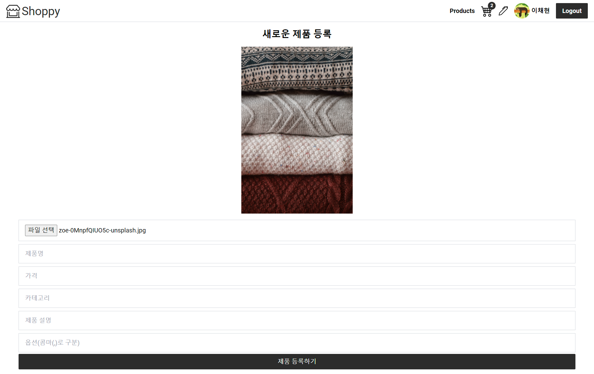

# 프로젝트 정보

- 온라인 쇼핑몰 구현

## 구현 내용

[✔] 로그인 - 구글 계정으로 로그인  
[✔] 로그아웃  
[✔] 경로 보호 - 관리자 계정으로 로그인 할 경우에만 제품 등록 페이지 접근 가능  
[✔] 장바구니 - 장바구니에 추가, 삭제, 수량 변경  
[✔] 새 상품 등록  
[✔] 로딩스피너  
[✔] 낮은가격, 높은가격 정렬

## 사용 기술

- firebase (데이터베이스, 인증)
- react-router-dom (페이지 라우팅)
- Context API (전역 데이터 관리 - user 정보, 로그인, 로그아웃 데이터 제공)
- 커스텀 훅 (데이터를 다루는 로직별로 나누어 관리)
- TanStack Query - 데이터 캐싱
- tailwind CSS (스타일링, 사용자 속성 지정 - 브랜드 색상)

### 구현화면

- 메인 화면  
  
- 관리자 로그인 화면
  
- 사용자 로그인 화면
  
- 새 제품 등록
  
